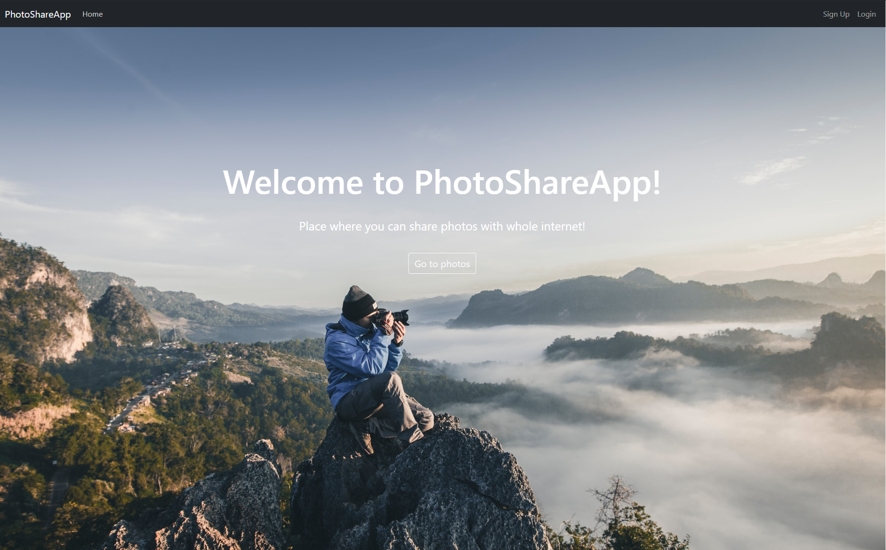
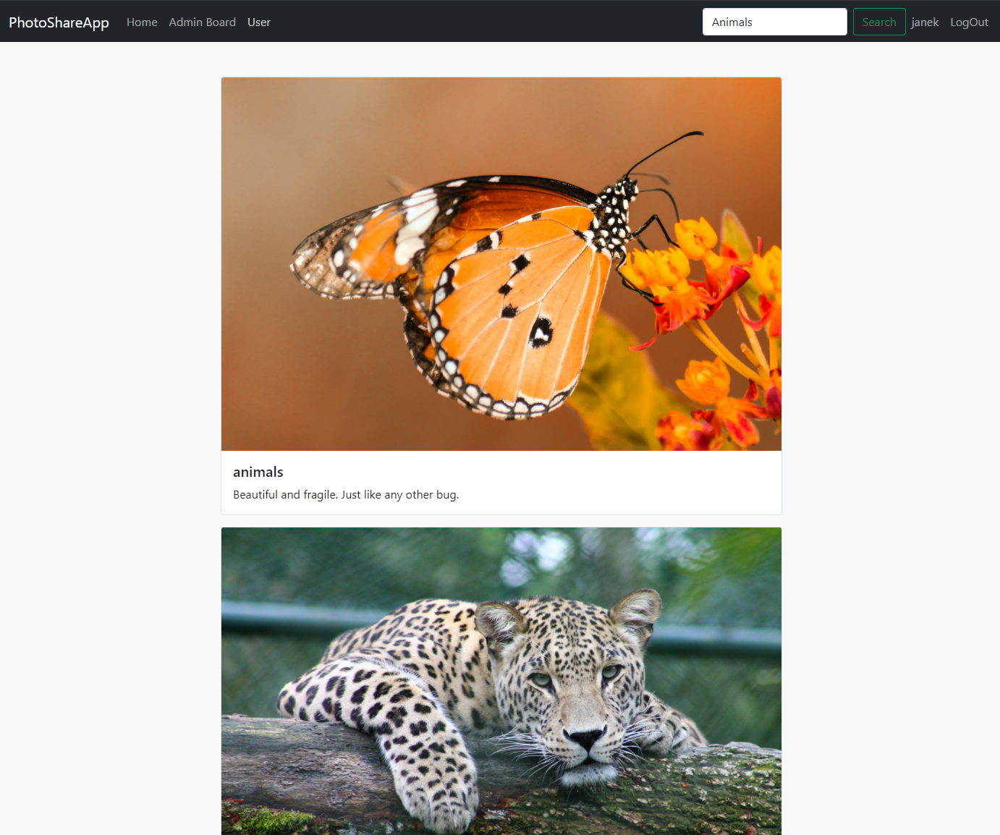
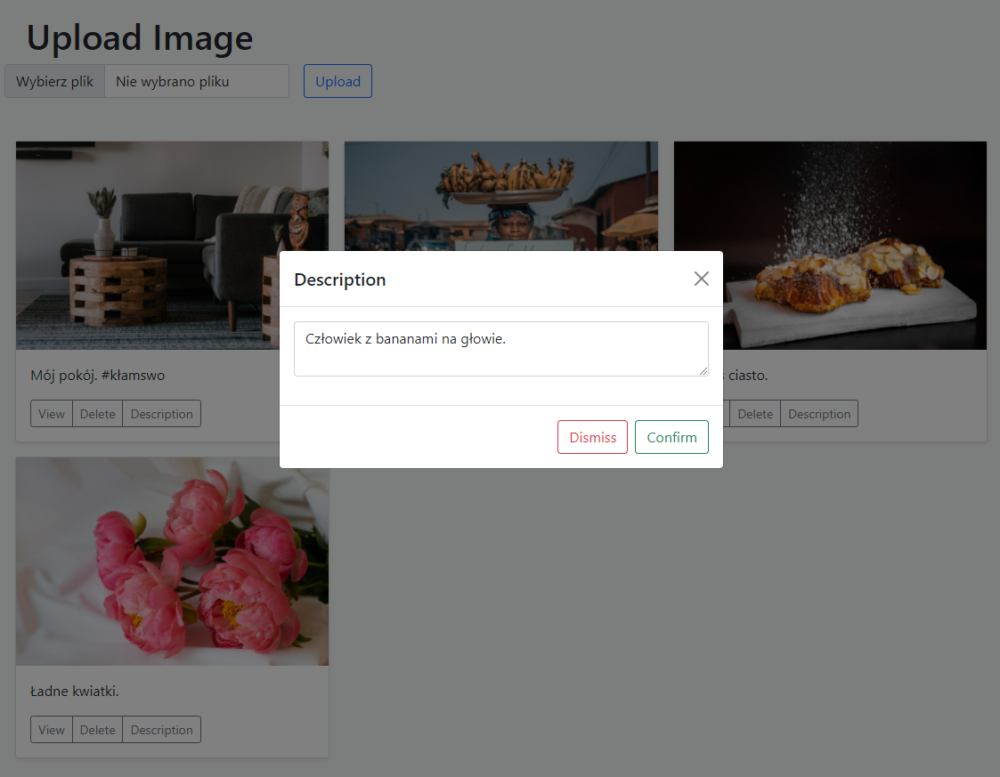
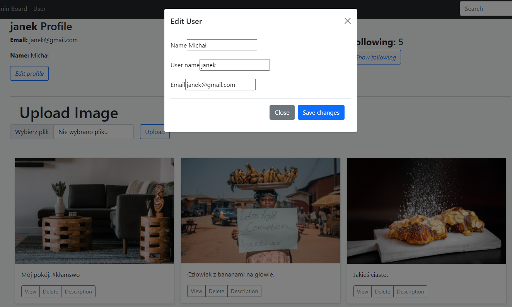
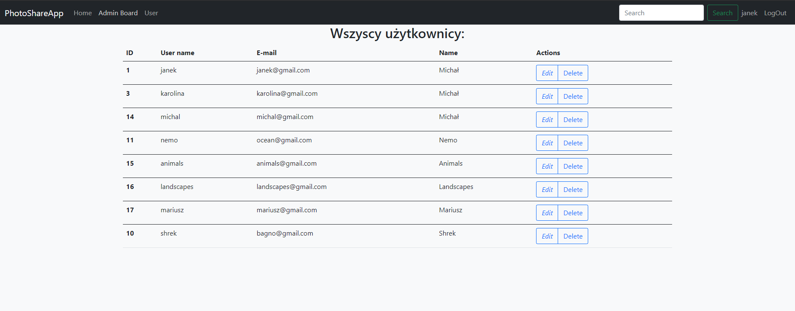
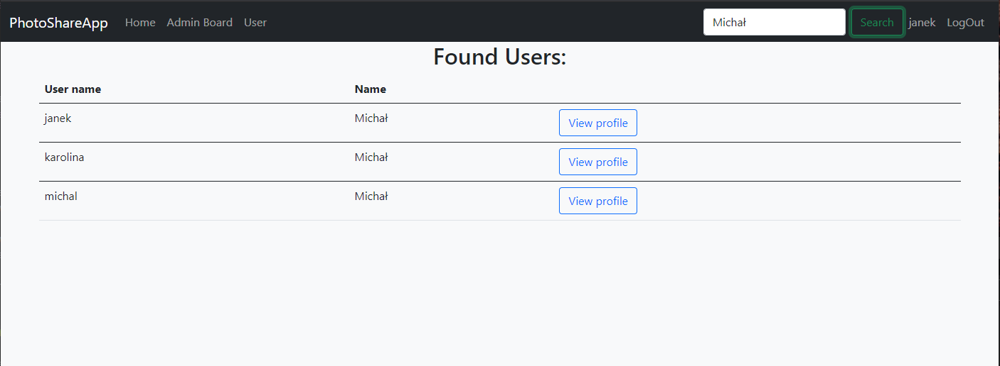
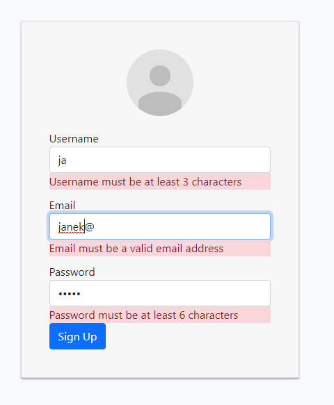

# PhotoShareApp

Project for Advanced Internet Applications subject at University classes

## Technologies
Spring boot, PostgreSQL and Bootstrap.

## Features
* Feed with photos from other users
> 
* Editing Photos descriptions
> 
* Editing profile data
> 
* Admin board with all users and ability to modify theri accounts
> 
* Seraching for user with name
> 
* Ability to follow, unfollow other users
> 
> * Registering new account with validation
> 
* Login and session with JWT
* Uploading your own photos

