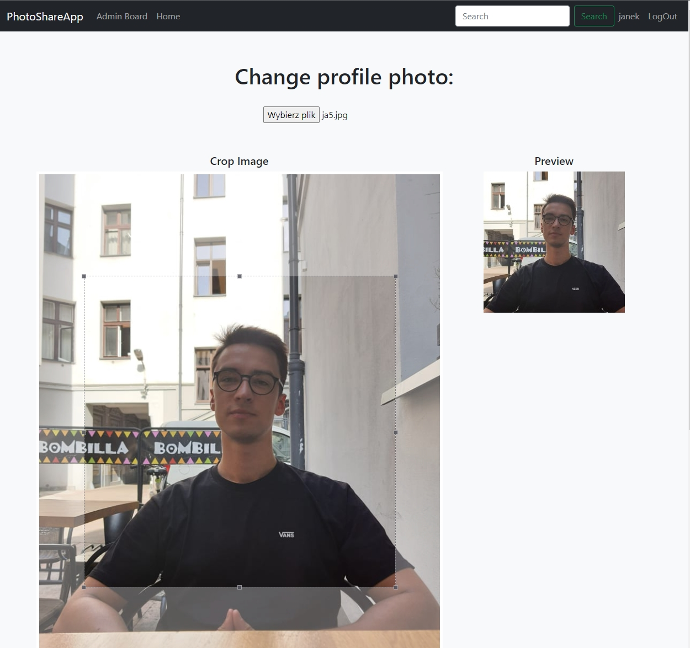
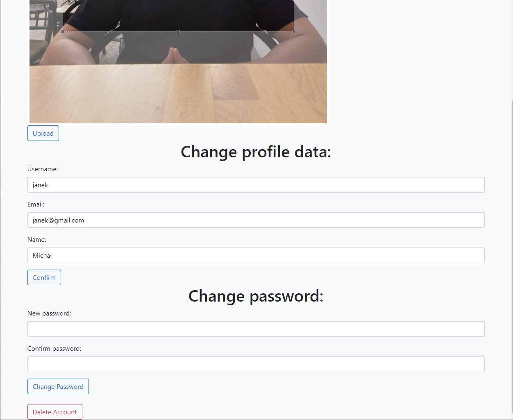

# PhotoShareApp

Project for Advanced Internet Applications subject at University classes

## Technologies
Spring boot, PostgreSQL and Bootstrap.

## Features
* Login and session with JWT
* Uploading your own photos
* pagination for feed on main page, admin board and comments
* Admin, Moderator and User roles with different privileges

* Feed with photos from other users
> 
* User profile
> 
* Editing Photos descriptions
> 
* Editing profile data
> 
> 

* Admin board with all users and ability to modify their accounts
> 
* Seraching for user with name
> 
* Registering new account with validation
> 

* View profiles of other users
> 

* Ability to follow, unfollow other users
> 
> 

